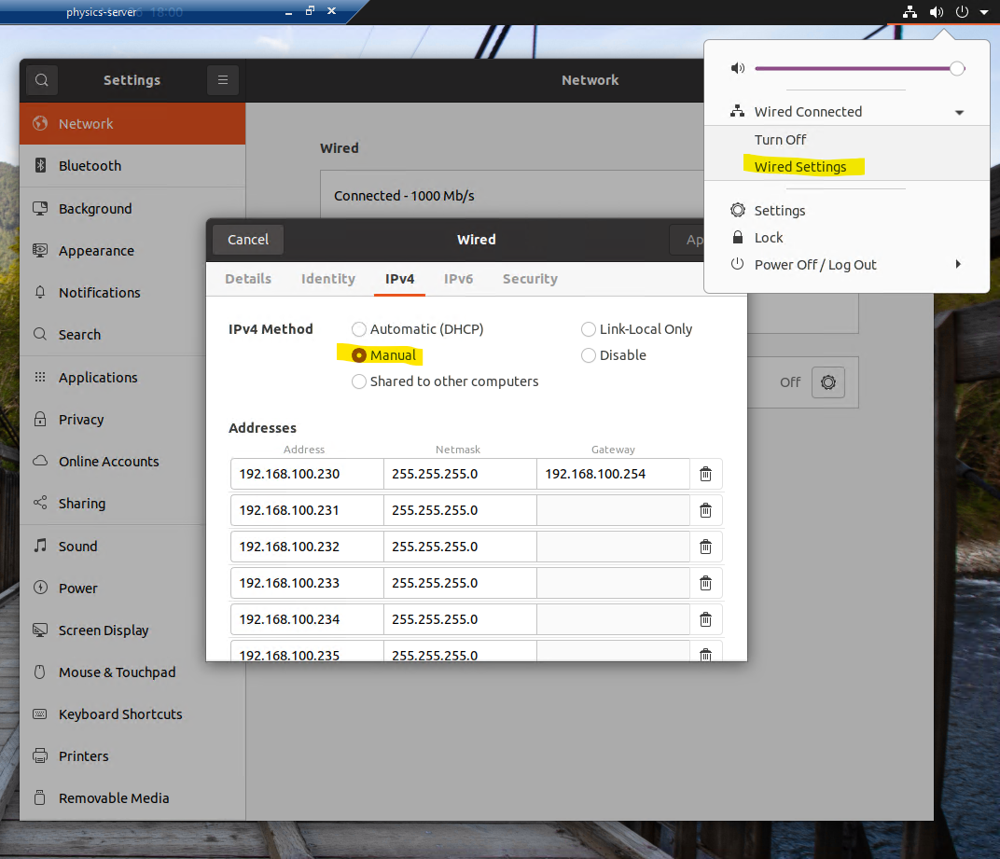
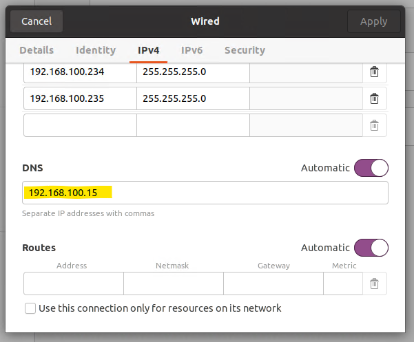

# SAMBA SSH Tunnelling

## Background

We need to access file shares across a range of sites. We do not yet have the
top level infrastructure to join the centre's domains together, so we need a
way to share network drives between sites for use by the PyMedPhys Streamlit
server. In the past we utilised tools such as Citrix's NetScaler Gateway,
however this often has intermittent connection issues and we wanted something
more reliable.

As such, we have set up a Windows OpenSSH server at one of our sites, and
provided access to that server from an SSH client at each site. That client
SSH machine then utilises SSH tunnelling to forward the appropriate ports
between the sites and the central hub where the PyMedPhys application is
running.

However, this by itself, does not enable network file sharing between sites.
The SAMBA port by default is port `445`. Linux machines are more than
capable of accessing file shares that are hosted on custom ports, but Windows
machines are not. So, even though the remote file-shares can be forwarded
through via SSH tunnelling to a range of ports, they cannot be accessed by
Windows clients.

As such, we need to remap the range of incoming ports onto port `445`. And
herein lies the issue. When a Windows machine boots up, port `445` is promptly
occupied by `lanman`. As such this port can no longer be utilised for SSH
tunnelling. This service can be set to be a delayed start, and then loopback
devices can be created, however we found that Windows updates would often come
in and clobber these settings throwing the whole networking system down.
This approach was documented over at <https://www.nikhef.nl/~janjust/CifsOverSSH/>.

As such, we instead opted to go for creating an Ubuntu machine within Hyper-V
and having it be in-charge of remapping the ports. This is the document
describing how to set up a fresh instance of an Ubuntu VM such that it can
remap SSH tunnelled SAMBA ports onto port `445` for use by Windows clients.
This approach has been reliable.

## Pre-requisites

* A fresh minimal installation of Ubuntu 20.04 within Hyper-V utilising the
  [official Ubuntu iso](https://mirror.aarnet.edu.au/pub/ubuntu/releases/20.04.2.0/ubuntu-20.04.2.0-desktop-amd64.iso).
  * Set this up with a single `External` type network adapter
  * Disable secure boot
  * Utilise Generation 2 so that UEFI is available
  * Throughout this document it will be assumed that the non-root username on
    the Ubuntu machine is `pexit`
* A set up Windows OpenSSH server. For use within this document it will be
  assumed that the server is running on the hostname `rccc-ssh` and all ssh
  clients will connect as the non-administrator `pexit` user. The config
  is the following:

```config
Port 38471
PubkeyAuthentication yes
PasswordAuthentication no
GatewayPorts yes
```

* SSH tunnels already set up to forwarding ports through to a PC on the local
  network. This PC throughout this document will be called `rccc-ssh`. The
  ports being forwarded through to `rccc-ssh` from remote SSH clients for this
  document will be ports `44445` - `44450`.
* A range of IP addresses that can be utilised for the remapping of port `445`
  onto them. Throughout this document these IP addresses will be
  `192.168.100.230` - `192.168.100.235`.
* The DNS IP address. Throughout this document this will be assumed to be
  `192.168.100.15`

## Overview

The general approach here will be to:

* first add the IP addresses that we will be occupying,
* then create an SSH key pair, add the public key to the server's list of
  authorised keys,
* and then lastly set up the appropriate SSH port forwarding so that it runs on
  boot and retries when there are network interruptions.

## Setting the IP addresses

Utilise the `gnome-control-center` to change the IPv4 network settings to
Manual, and then add in the IP addresses that you would like to have this
VM occupy.



Once the IPv4 method has been set to Manual you may lose internet access
and/or the ability to resolve network hostnames. As such you need to also add
in the IP address of the DNS server.



## Add SSH server to hosts file

At this stage, the Ubuntu image in question still struggled to find the
`rccc-ssh` host. As such, as a work-a-round, the file at `/etc/hosts` was
edited to include the line `192.168.100.13  rccc-ssh`.

## Initial set up of the SSH connection

Run the command `ssh-keygen -t ed25519` to create an SSH key pair. See the
[GitHub docs](https://docs.github.com/en/github/authenticating-to-github/generating-a-new-ssh-key-and-adding-it-to-the-ssh-agent)
for more details on this.

Then add the contents of the newly created file `~/.ssh/id_ed25519.pub` to the
`C:\Users\pexit\.ssh\authorized_keys` file stored on the `rccc-ssh` server.

Then test that this has been successful by running:

```bash
ssh pexit@rccc-ssh -p 38471
```

The above command is required at least once, so that the host key can be added
by ssh to the `known_hosts` file.

```{note}
If you see the error `Permission denied (publickey,keyboard-interactive)` the
cause is likely either the key hasn't been added to the `authorized_keys` file
appropriately, or that the `authorized_keys` file has the wrong permissions.
Simply deleting the `authorized_keys` file and then recreating it as the
`pexit` user should fix its permissions. To see if this is working it a helpful
troubleshooting step is to see if the `pexit` user can ssh into
`pexit@localhost` while on the `rccc-ssh` server.
```

Since port `445` is a privileged port we need to utilise `authbind` to allow
`ssh` to listen on this port without being a root user. This process is as
follows utilising the tips found at <https://superuser.com/a/892391>:

```bash
sudo apt install authbind
sudo touch /etc/authbind/byport/445
sudo chmod 777 /etc/authbind/byport/445
```

Then, from there, an initial test of the port forwarding can be undergone:

```bash
authbind ssh -N -L 192.168.100.233:445:localhost:44448 pexit@rccc-ssh -p 38471
```

With the above command still running, verify that going to the address
`\\192.168.100.233` within Windows Explorer on a Windows client does indeed
present the user with the tunnelled network share drive.

## Setting up the SSH port forward service to run on boot

So that the port forwarding is self-healing in case of network interruptions
we will be utilising the package `autossh`. These instructions here were
adapted from <https://www.everythingcli.org/ssh-tunnelling-for-fun-and-profit-autossh/#gfm-8>.

Also, when running this `autossh` service, we want the service to run as the
`pexit` user so that the SSH key-pair created and authorised above gets
utilised. And so that we are not unnecessarily running our commands as root.
The guide for adding a `systemd` service as a custom user was adapted from
<https://askubuntu.com/a/676022>.

First, verify that the command that is going to be run works as expected. In
our case this full command was:

```bash
/usr/bin/authbind --deep \
  /usr/bin/autossh -M 0 -o "ServerAliveInterval 30" -o "ServerAliveCountMax 3" -N \
  -L 192.168.100.230:445:localhost:44445 \
  -L 192.168.100.231:445:localhost:44446 \
  -L 192.168.100.232:445:localhost:44447 \
  -L 192.168.100.233:445:localhost:44448 \
  -L 192.168.100.234:445:localhost:44449 \
  -L 192.168.100.235:445:localhost:44450 \
  pexit@rccc-ssh -p 38471
```

Then, once it has been verified that the above command worked as expected,
the following file was created at `/etc/systemd/system/autossh-samba-tunnel.service`:

```service
[Unit]
Description=AutoSSH samba port forwarding
After=network.target

[Service]
User=pexit
Group=pexit
Environment="AUTOSSH_GATETIME=0"
ExecStart=/usr/bin/authbind --deep \
  /usr/bin/autossh -M 0 -o "ServerAliveInterval 30" -o "ServerAliveCountMax 3" -N \
  -L 192.168.100.230:445:localhost:44445 \
  -L 192.168.100.231:445:localhost:44446 \
  -L 192.168.100.232:445:localhost:44447 \
  -L 192.168.100.233:445:localhost:44448 \
  -L 192.168.100.234:445:localhost:44449 \
  -L 192.168.100.235:445:localhost:44450 \
  pexit@rccc-ssh -p 38471

[Install]
WantedBy=multi-user.target
```

To then enable this service the following was run:

```bash
sudo systemctl daemon-reload
sudo systemctl start autossh-samba-tunnel.service
sudo systemctl enable autossh-samba-tunnel.service
```
